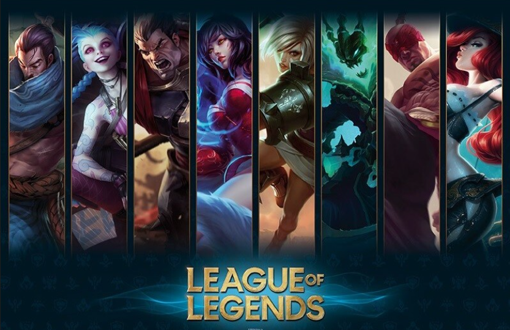

# **LOL VICTORY PREDICTION ML**

This is my first Machine Learning project. We worked in a team of 3 students on the problem :

"*How to predict which league of legends team will win based on the teams composition ?*"

There is a Python Notebook where everything is explained in french, but there is a summary.

## **Summary**
We trained 3 differents models : Decision Tree, Random Forest and Atificial Neural Network on the same dataset (which contains 34000 match data) and we got 3 first accuracy CV scores.

Then, we add a synergy score for each champion pair based on their win rate. And we used that score to enrich the dataset. We retrained each model and got better scores for Decision Tree and Random Forest.

Model  | First accuracy CV score | Accuracy CV score with synergies
--------|:------------------------:|:------------------------:
Decision Tree (DT)   | 86.9 %      | 88.0 %
Random Forest (RF)   | 87.1 %      | 89.9 %
Artificial Neural Network (ANN) | 76.3 % | 67.1 %

